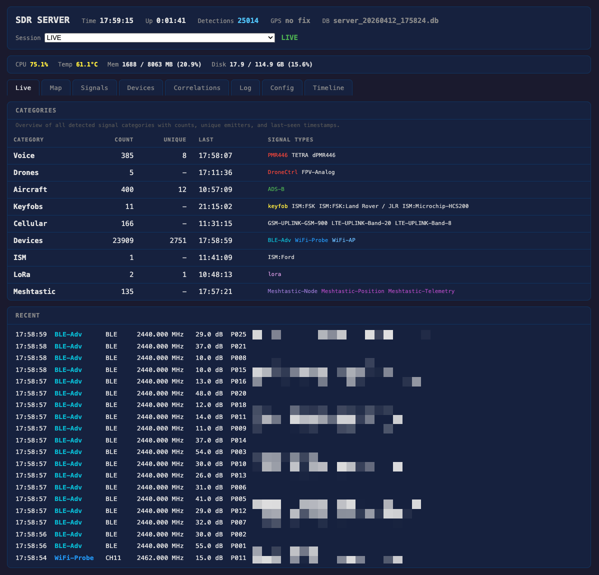

# SIGINT

ATAK + SDR for Signal Triangulation

A distributed SIGINT system that detects radio emissions from the field, triangulates emitter positions via RSSI multilateration, and overlays them on ATAK in real time.



* Central server (pelican case) with wideband SDRs continuously scans all bands
* Lightweight sensor nodes (~$80/unit) with RTL-SDR + GPS are distributed across the area
* **Short-burst signals** (keyfobs, TPMS, pagers): nodes scan autonomously, triangulation via post-hoc correlation
* **Long signals** (PMR voice, GSM sessions): central detects and tasks nodes to tune and measure RSSI
* 3+ RSSI reports from known GPS positions → multilateration → emitter position → CoT to ATAK

## Quick Start

```sh
# Install (see docs/installation.md for full steps)
sudo apt-get install -y cmake libusb-1.0-0-dev ffmpeg python3-full python3-venv
python3 -m venv venv && source venv/bin/activate
pip install -r requirements.txt

# Run a scanner
cd src
python3 sdr.py pmr                    # PMR446 walkie-talkie channels
python3 sdr.py fm marine              # Marine VHF
python3 sdr.py keyfob                 # Car keyfobs (433 MHz)
python3 sdr.py adsb                   # Aircraft tracking
python3 sdr.py --help                 # All options
```

## Modules

| Module | Command | Frequency |
|--------|---------|-----------|
| PMR446 | `sdr.py pmr` | 446 MHz |
| FM Scanner | `sdr.py fm <band>` | Configurable |
| FRS/GMRS | `sdr.py fm frs` | 462-467 MHz |
| Marine VHF | `sdr.py fm marine` | 156-162 MHz |
| MURS | `sdr.py fm murs` | 151-154 MHz |
| 2m Amateur | `sdr.py fm 2m` | 144-148 MHz |
| 70cm Amateur | `sdr.py fm 70cm` | 430-446 MHz |
| CB Radio (EU) | `sdr.py fm cb` | 27 MHz |
| Land Mobile | `sdr.py fm landmobile` | 157-163 MHz |
| TETRA | `sdr.py fm tetra` | 380-400 MHz |
| TETRA Private | `sdr.py fm tetra-priv` | 410-430 MHz |
| P25 | `sdr.py fm p25` | VHF/UHF |
| Keyfob | `sdr.py keyfob` | 315/433 MHz |
| TPMS | `sdr.py tpms` | 315/433 MHz |
| GSM | `sdr.py gsm` | 935-960 MHz |
| LTE | `sdr.py lte` | 700-2600 MHz |
| ADS-B | `sdr.py adsb` | 1090 MHz |
| AIS | `sdr.py ais` | 162 MHz |
| POCSAG | `sdr.py pocsag` | 152-929 MHz |
| ISM | `sdr.py ism` | 433/868/915 MHz |
| LoRa | `sdr.py lora` | 868/915 MHz |
| ELRS/Crossfire | via `sdr.py server` | 868/915 MHz |
| WiFi | `sdr.py wifi` | 2.4 GHz |
| Bluetooth | `sdr.py bt` | 2.4 GHz |
| Wideband Scan | `sdr.py scan` | Configurable |
| Recorder | `sdr.py record` | Any |
| Replay | `sdr.py replay` | — |
| Triangulate | `sdr.py tri` | — |
| Heatmap | `sdr.py heatmap` | — |
| Correlate | `sdr.py correlate` | — |
| Central Server | `sdr.py server` | All bands |
| Web Dashboard | `sdr.py web` | — |

See [docs/modules.md](docs/modules.md) for descriptions, test notes, and known limitations.

## Usage

```sh
cd src

# Common options
python3 sdr.py pmr --transcribe              # Speech-to-text (Whisper)
python3 sdr.py pmr --digital                 # dPMR/DMR energy detection
python3 sdr.py pmr --gain 30 --output ./logs # Custom gain and output dir
python3 sdr.py --gps pmr                     # Enable GPS for detections
python3 sdr.py --device-index 1 fm 2m        # Select specific RTL-SDR

# WiFi / BLE (require sudo)
sudo python3 sdr.py wifi                     # Probe requests + drone RemoteID
sudo python3 sdr.py bt                       # BLE advertisements + drone RemoteID

# Wideband scan with modulation classification
python3 sdr.py scan --classify               # Auto-classify detected signals (FM, OOK, FSK, PSK...)

# Triangulate from multi-node detection logs
python3 sdr.py tri node_a.db node_b.db node_c.db
python3 sdr.py tri a.db b.db --use-snr       # Different gains across nodes

# Post-hoc analysis
python3 sdr.py heatmap output/*.db           # Generate RF activity heatmap (KML for ATAK)
python3 sdr.py correlate output/*.db         # Find co-occurring devices across signal types

# Central server (all captures in parallel)
sudo python3 sdr.py server configs/server.json         # Default config
sudo python3 sdr.py --tak --gps server configs/server_voice.json  # Voice recording config
sudo python3 sdr.py server configs/server.json --web   # Server with web dashboard

# Web dashboard (standalone, reads from output directory)
# - Category tabs: Voice / Drones / Aircraft / Vessels / Vehicles /
#   Cellular / Devices / Other, each with domain-specific columns.
# - Map tab: Leaflet canvas showing Aircraft / Vessels / Drones /
#   Operators positions on OpenStreetMap, auto-refreshing.
# - Session dropdown in the header lets you browse historical .db files.
# - Devices tab: WiFi APs / WiFi Clients / BLE sub-tabs with RSSI
#   column and AirTag / Find My accessory detection.
python3 sdr.py web                                     # Default port 8080
python3 sdr.py web -p 3000                             # Custom port
python3 sdr.py web -d /path/to/output                  # Custom output directory

# Stream to ATAK
python3 sdr.py --tak --gps pmr
```

## Tests

```sh
python3 tests/sw/test_pmr_demod.py       # Async streaming, demod pipeline
python3 tests/sw/test_pmr_quality.py     # Audio quality regression
python3 tests/sw/test_transcribe.py      # Whisper EN/ES/CA transcription
python3 tests/sw/test_fm_voice_parser.py # FM voice parser (no hardware)
python3 tests/sw/test_pmr_quality.py --rf    # RF loopback (needs HackRF + RTL-SDR)
python3 tests/hw/tx_pmr_loopback.py          # Full TX/RX loopback
```

## Analysis & Intelligence

| Feature | Description |
|---------|-------------|
| **Heatmap** | RF activity density overlay for ATAK maps (KML + PNG). Live export from server or post-hoc from `.db` logs. |
| **Movement Trails** | Per-device position history as CoT polylines on ATAK. Automatic for mobile emitters (TPMS, BLE, WiFi, drones). |
| **Device Correlation** | Cross-signal-type co-occurrence analysis. Finds clusters of devices that always appear together. |
| **Modulation Classification** | Heuristic AMC from IQ statistics: FM, OOK, FSK, PSK, QAM, OFDM, FHSS, CW. No ML/GPU needed. |
| **Wavelet Detection** | CWT-based burst detection for low-SNR transients that FFT energy detection misses. |
| **RF Fingerprinting** | IQ-level transmitter hardware identification (CFO, I/Q imbalance, rise time). Research-grade. |

## Ideas / Future

- **TPMS tail detection** — Log sensor IDs while driving. Recurring IDs across 3+ GPS positions = someone following you.
- **Parking lot census** — Fingerprint parked vehicles via TPMS sensor IDs over time.
- **DMR decoding** — Pipe discriminator audio through DSD/dsd-fme for voice or radio ID extraction.
- **IMSI catcher detection** — Compare observed cell IDs against OpenCelliD, flag unknown towers.
- **GPS jamming detection** — Monitor L1 band (1575.42 MHz) for abnormal power levels.
- **Tracker detection (RF)** — Monitor 800-960 MHz for periodic GSM/LTE bursts from hidden GPS trackers.
- **Tracker detection (BLE)** — Tile advertisement parsing; AirTag/Find My classification is already implemented (see Devices tab). Missing: full anti-stalking detection across GPS positions per the IETF `draft-detecting-unwanted-location-trackers`.
- **Doppler / TDOA** — Time-difference-of-arrival for more precise geolocation. Requires GPS PPS time sync.
- **ML-based AMC** — ONNX Runtime + RadioML pre-trained model for deeper modulation classification on CPU.

## Documentation

- [Architecture](docs/architecture.md) — system design, task protocol, phases, design principles
- [Hardware](docs/hardware.md) — central server, sensor nodes, comms, antennas
- [Modules](docs/modules.md) — full module list with test notes and known limitations
- [Triangulation](docs/triangulation.md) — RSSI multilateration, path loss parameters, node spacing
- [TAK Integration](docs/tak.md) — certificate setup, ATAK streaming
- [Installation](docs/installation.md) — Raspberry Pi and macOS setup

## References

* https://github.com/ATAKRR/atakrr
* https://github.com/kamakauzy/ReconRaven
