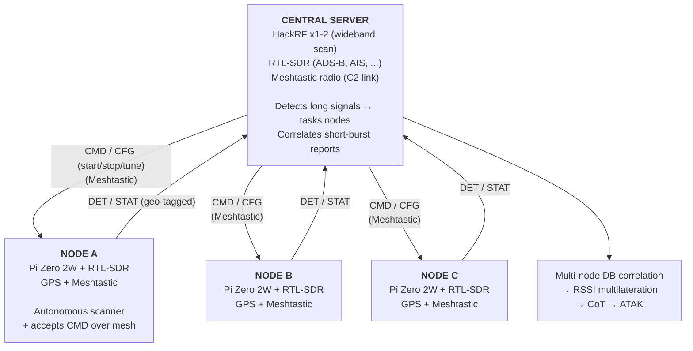

# Architecture

## Hybrid: autonomous short-burst + central-orchestrated long signals

Nodes scan short-burst frequencies (keyfobs, TPMS, pagers, BLE, WiFi) autonomously — those signals are gone before any central coordination could happen. The central server handles wideband monitoring and orchestrates nodes over Meshtastic for longer-duration signals.



## Capture → Parser → Scanner pipeline

The `src/` tree is organized around a three-layer pipeline:

- **`capture/`** — hardware abstractions. Each source owns one device and emits raw frames via `add_parser(callback)`. Backends: `rtlsdr_iq`, `rtlsdr_sweep`, `hackrf_iq`, `ble`, `wifi`, `meshtastic`, plus a `channelizer` that splits one wideband HackRF stream into many narrowband channels.
- **`parsers/`** — pure signal decoders. They consume frames via `handle_frame(frame)` and produce `SignalDetection` objects. Grouped by domain: `fm/`, `ble/`, `cellular/`, `ook/`, `wifi/`, `lora/`, `marine/`, `meshtastic/`, `drone/`.
- **`scanners/`** — thin orchestrators wiring a capture source to parsers. Adding a new protocol on an existing frequency means writing a parser, plugging it into an existing capture — no new hardware code needed.

Helpers live in `utils/` (SQLite logger, GPS reader, heatmap, correlator, transcriber, persona/AP DBs, TAK client, OUI lookup).

## C2 layer

Remote agents run `sdr.py agent`. They beacon `HELLO` over Meshtastic; the server shows them as pending in the **Agents** tab until the operator clicks **Approve**. Once approved:

- Server sends `CMD START <scanner>` → agent spawns a `sdr.py <scanner>` subprocess with `--gps` if configured
- Scanner writes detections to a local `.db`
- A `DBTailer` in the agent watches that `.db` and forwards each new row as a `DET` message over the mesh
- The server's `AgentManager` ingests `DET` into a single `output/agents_YYYYMMDD_HHMMSS.db`; the same web dashboard and triangulation tooling work on it with no changes

Full protocol reference: [c2.md](c2.md). Setup: [service-setup.md](service-setup.md).

## Storage

Per-session SQLite per signal type (`<type>_YYYYMMDD_HHMMSS.db`). WAL mode, `synchronous=NORMAL`, indexes on `(signal_type, ts_epoch)`, `ts_epoch`, `device_id`, and `(signal_type, device_id)`.

- **SQL-first dashboard** — every web endpoint queries the `.db` files via `web/fetch.py`. No in-memory state, restart-safe. The tailer is just a watcher + 2 s cache refresher.
- **Root vs user** — the server runs as sudo for BLE/WiFi; the web UI can run as a normal user. `db.connect(readonly=True)` falls back to `?mode=ro&immutable=1` on `OperationalError`.
- **Export** — shell out to `sqlite3 out.db -csv -header "SELECT * FROM detections"` if you need CSV.

## Analysis layer

Sits on top of the detection stream (real-time `on_detection` callback in the central server, or post-hoc queries against `.db` files):

```
Detections
   │
   ├── Heatmap generator        → KML GroundOverlay for ATAK
   │    spatial binning, log-scale color gradient
   │
   ├── Trail tracker            → CoT polylines for ATAK
   │    per-device ring buffer, movement detection
   │
   ├── Device correlator        → JSON clusters (on-demand from SQL)
   │    time-binned co-occurrence, union-find clustering
   │
   ├── Cross-node witnesses     → "server + N01 heard X in the window"
   │    per-type key match, Correlations tab
   │
   ├── Live triangulation       → RSSI multilateration from last 5 min
   │    per-capturing-node split, calibrated power, Map tab crosshairs
   │
   ├── Opportunistic calibration→ per-(node, band) RSSI offsets
   │    surveyed APs / FM / cell + ADS-B / AIS; Huber regression
   │
   └── DSP analysis
       ├── AMC                   → modulation classification (FM, OOK, FSK, PSK, QAM, OFDM, FHSS)
       ├── Wavelet               → CWT/STFT low-SNR burst detection
       └── RF fingerprint        → IQ-level transmitter identification (CFO, I/Q imbalance, rise time)
```

Post-hoc CLIs: `sdr.py heatmap`, `sdr.py correlate`, `sdr.py triangulate`, `sdr.py calibrate`, `sdr.py replay-c2`.

## Design principles

- **Hybrid control.** Each signal type gets the approach that fits its duration. Short bursts → autonomous; long sessions → orchestrated.
- **Detection + RSSI is the priority.** Knowing "someone is transmitting on PMR CH3 at −35 dB from position X" is the core value. Audio decoding is secondary.
- **Nodes are cheap but not dumb.** One RTL-SDR, one GPS, one Meshtastic radio, ~$80 per unit. They run scanners autonomously and accept retune commands.
- **Each scanner runs independently.** Run one module at a time, or many in parallel on different SDRs.
- **Single-tuner tradeoff.** A node retasked over C2 loses whatever autonomous coverage it had. Mitigated by staggering nodes and keeping retune windows short.
- **No hidden mutable state.** SQLite on disk is the source of truth; in-memory caches expire in seconds.
